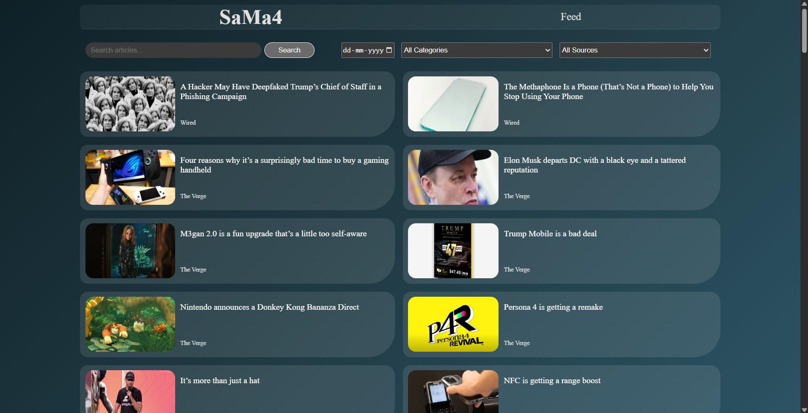

# 📰 News Article Aggregator

A responsive web application that aggregates news articles from multiple sources. The project demonstrates core concepts such as API integration, search, filtering, state management using Redux Toolkit.

## ✅ Features

- Aggregates news data from multiple APIs (planned: 3 API integration)
- Search articles by keyword
- Filter articles by:

  - Date
  - Category
  - Source

- Personalized news feed based on user preferences (categories, sources, authors)
- Mobile-responsive design
- Clean component structure with CSS Modules for styling

## 🛠️ Tech Stack

- Frontend : ReactJS (Vite)
- State Management : Redux Toolkit (Thunk)
- Styling : CSS Modules
- Routing : React Router (Declarative Mode)
- Containerization : Docker

## 📦 Folder Structure

```bash
src/
├── components/ # Reusable UI components
├── pages/ # App Pages
    ├── articles/
    ├── feed/
├── services/ # State, Store and API services
    ├── redux/ # App Store
    ├── api.js # API fetching
├── App.jsx
├── main.jsx
```

## 🚀 Getting Started

1. Clone the Repository
   ```bash
     git clone https://github.com/your-username/news-aggregator.git
     cd news-aggregator
   ```
2. Install Dependencies
   ```bash
    npm install
   ```
3. Run the Application
   ```bash
     npm run dev
   ```
4. Application will be accessible at http://localhost:5173

## 🗺️ Application Routing

- Implemented using React Router - Declarative Mode

- News Articles Page – Displays all available news articles with search and filtering options

- News Feed Page – Displays personalized news feed based on user preferences

## 🎨 Styling

- Component-scoped styles with CSS Modules
- Planned improvements with Tailwind CSS or Material UI

## 🐳 Docker Instructions

- Build Docker Image :

```bash
docker build -t react-app:dev .
```

- Run Docker Container :

```bash
docker run -p 5173:5173 react-app:dev
```

- The application will be available at http://localhost:5173

## 📸 UI

1. Landing Page
   

2. Search
   

3. Search and Filter
   

4. Preferences Modal
   

5. Feed Page
   

## ✅ Requirements Status

- Article search and filtering
- Mobile-responsive design
- Personalized news feed (in-progress)

## 🔧 Planned Improvements

- Add loading UI on Pages.
- Integrate 3 separate News APIs and aggregate their data
- Modal to display detailed news content with external links
- Standardize props and structure to handle multi-API data uniformly
- Implement Tailwind CSS or Material UI for modernized design
- Migrate project to TypeScript for improved type safety
- Improve mobile search experience with animated transition for search bar
